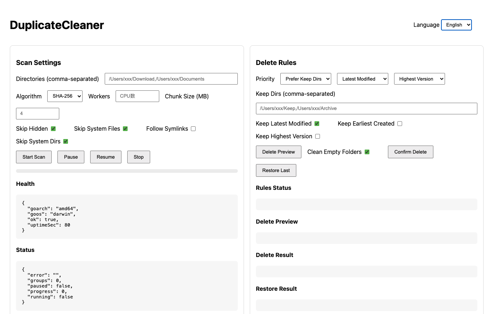

# DuplicateCleaner

Switch language: [English](./README.md) | [中文](./README.zh-CN.md)

DuplicateCleaner is a cross-platform duplicate file scanner and safer remover with a simple web UI. It identifies duplicates primarily by cryptographic hashes (SHA-256 by default, MD5 optional) and uses file size and timestamps to reduce unnecessary work. Deletion is never permanent: files are moved to a backup directory for easy recovery. Rules and priorities are configurable, and all operations are logged.

## Features
- Accurate duplicate detection
  - Hash-based (SHA-256/MD5), chunked reading for large files
  - Size pre-filter: different sizes are never duplicates
  - Change detection: flags files that change during hashing
- Safety first
  - Mandatory preview step before removal
  - Removal = move to backup directory (Duplicate_Backup), not permanent deletion
  - Skip system/hidden/read-only files by default
- Configurable rules and priority
  - Keep files in specified directories
  - Keep latest modified or earliest created (creation time depends on OS availability)
  - Keep by highest version in file name (e.g., v2.1 > v1.9)
  - Tie-breaker: path lexicographical order
- Performance and compatibility
  - Concurrency with worker pool
  - Hash cache to avoid recomputing unchanged files
  - Symlink handling (off by default)
  - Works on macOS/Linux/Windows (path handling via Go stdlib)
- Logging and troubleshooting
  - JSONL logs in `logs/duplicate_cleaner.log`
  - Logs include scan inputs, results, rule updates, preview, confirmation, and errors

## Getting Started

### Requirements
- Go 1.22+

### Run
```bash
go run ./cmd/server
# default port: 8713
```

### Custom Port
```bash
go run ./cmd/server -port 9001
```

Open the web UI:
```
http://localhost:8713/  # or your custom port
```

## Releases
- Format: archives per OS/Arch with checksums, built via GoReleaser
- Artifacts naming: `DuplicateCleaner_vX.Y.Z_{os}_{arch}.{tar.gz|zip}`
- OS/Arch: macOS (darwin/amd64, darwin/arm64), Linux (linux/amd64, linux/arm64), Windows (windows/amd64, windows/arm64)
- Version injection: binary embeds version via `-X main.Version`

### Publish
- Create a tag `vX.Y.Z` and push
- GitHub Actions runs GoReleaser and publishes assets and checksums

## Web UI
- Configure scan directories, hash algorithm, hidden/system directory handling, symlink following, worker count, and chunk size
- Start scan, view progress, view results, set rule priority, preview and confirm deletion (to backup)
- Auto-refresh status and results every second; pause/resume/stop a running scan directly from the UI.
- Rules auto-update: changes to priority, keep-dirs and flags take effect immediately (no extra button needed).
- Bilingual UI: auto-detects browser language (non-Chinese → English by default) and allows manual switching between English and Chinese.
- Direct Delete (Trash): optional checkbox next to Confirm Delete; default off. When enabled, files are moved to OS Trash without backup (macOS: ~/.Trash; Linux: freedesktop ~/.local/share/Trash; Windows: Recycle Bin).

## UI Preview


## Options and Behavior
- Algorithm
  - Hash function used for duplicate detection: SHA-256 (default) or MD5.
  - Drives content equality. Changing algorithm requires recomputation unless cached.
- Max Workers
  - Concurrency level for hashing; controls the worker pool size.
  - Higher values increase parallelism but may raise I/O pressure.
- Chunk Size (MB)
  - Per-file chunk size for hashing to support very large files efficiently.
  - Larger chunks reduce hashing overhead but increase memory footprint per worker.
- Skip Hidden
  - Skips entries whose names start with a dot (.) and common hidden items.
  - Applies to directories and files; reduces scanning noise from user config/aux folders.
- Skip System Files
  - Skips OS/desktop metadata that do not carry user content:
    - macOS: .DS_Store, ._*, .localized
    - Windows: Thumbs.db, Desktop.ini
    - Linux: .directory
- Follow Symlinks
  - When enabled, follows symlinked files; otherwise symlinks are ignored.
  - Disabled by default to avoid cycles and unexpected cross-directory reads.
- Skip System Dirs
  - Skips system-level directories:
    - macOS: /System
    - Linux: /usr
    - Windows: C:\Windows
- Priority
  - Rule application order; higher-priority rules shrink candidates first.
  - Typical set: [KeepDirs, KeepLatestModify, KeepHighestVersion]; ties fall back to path lexicographical order.
- Keep Dirs
  - Prefer keeping files under specified directories; if multiple match, keep path-lexicographically earliest.
- Keep Latest Modify
  - Keep the most recently modified file among duplicates.
  - Creation time is not uniformly available; modification time is used consistently.
- Keep Earliest Create
  - Keep the earliest file by timestamp; where creation time is unavailable, modification time is used as a proxy.
- Keep Highest Version
  - Parse version from filename (pattern v?X.Y.Z) and keep the numerically highest version.
  - Non-numeric or missing versions are treated as 0; ties fall back to path ordering.
- Clean Empty Dirs
  - When enabled, remove empty parent directories within the scanned directories after deletion.
  - Boundaries are the provided scan directories; directories outside are not removed.
  - Default: enabled.

## Deletion and Restore
- Deletion is non-destructive: files are moved to Duplicate_Backup with timestamped names.
- A manifest file Duplicate_Backup/restore_last.json records the mapping of original → backup for the last delete.
- Restore Last
  - Restores files from the last manifest back to their original paths.
  - Skips if target already exists to avoid overwriting.
  - Intended to undo the most recent delete; historical batches can be supported by extending manifest archival.
- Direct Delete Mode
  - When the “Direct Delete (Trash)” option is enabled, deletion goes to the OS Trash (macOS: ~/.Trash; Linux: freedesktop ~/.local/share/Trash). No backup manifest is created and “Restore Last” does not apply.
  - Windows: moves to Recycle Bin via Shell API.

## API

Start scan:
```bash
curl -X POST http://localhost:8713/api/scan/start \
  -H "Content-Type: application/json" \
  -d '{
    "dirs": ["/path/one", "/path/two"],
    "hashAlgo": "sha256",
    "skipHidden": true,
    "followSymlinks": false,
    "skipSystemDirs": true,
    "maxWorkers": 8,
    "chunkSizeBytes": 4194304,
    "enableHashCache": true,
    "hashCachePath": ".cache/hashes.json",
    "skipReadOnly": true
  }'
```

Check status:
```bash
curl http://localhost:8713/api/scan/status
```

Get results:
```bash
curl http://localhost:8713/api/scan/results
```

Update rules:
```bash
curl -X POST http://localhost:8713/api/rules \
  -H "Content-Type: application/json" \
  -d '{
    "priority": ["指定文件夹","最新修改","最大版本号"],
    "keepDirs": ["/path/keep"],
    "keepLatestModify": true,
    "keepEarliestCreate": false,
    "keepHighestVersion": true
  }'
```

Preview deletion:
```bash
curl -X POST http://localhost:8713/api/delete/preview
```

Confirm deletion (move to backup):
```bash
curl -X POST http://localhost:8713/api/delete/confirm
```

Confirm deletion with cleaning empty dirs:
```bash
curl -X POST http://localhost:8713/api/delete/confirm \
  -H "Content-Type: application/json" \
  -d '{ "cleanEmptyDirs": true }'
```

Confirm deletion to OS Trash (no backup):
```bash
curl -X POST http://localhost:8713/api/delete/confirm \
  -H "Content-Type: application/json" \
  -d '{ "directToTrash": true }'
```
Restore last deletion:
```bash
curl -X POST http://localhost:8713/api/delete/restore
```

## Project Structure
```
cmd/server/          # entry point
internal/web/        # web router and UI
internal/scanner/    # directory scan and hashing
internal/hash/       # hashing by chunk
internal/rules/      # rule engine and priorities
internal/backup/     # move-to-backup deletion
internal/cache/      # hash cache store
internal/logging/    # JSONL logging
internal/types/      # shared structs
```

## Notes
- System directory skipping:
  - macOS: `/System`
  - Linux: `/usr`
  - Windows: `C:\Windows`
- System files skipping (default on):
  - macOS: `.DS_Store`, `._*`, `.localized`
  - Windows: `Thumbs.db`, `Desktop.ini`
  - Linux: `.directory`
- Symlink handling: off by default to avoid loops; can be enabled via options
- Creation time: Go stdlib does not uniformly expose file creation time across OSes; “earliest created” uses available metadata where applicable, otherwise modification time as a proxy

## License
MIT

For Chinese documentation, see [README.zh-CN.md](./README.zh-CN.md).
