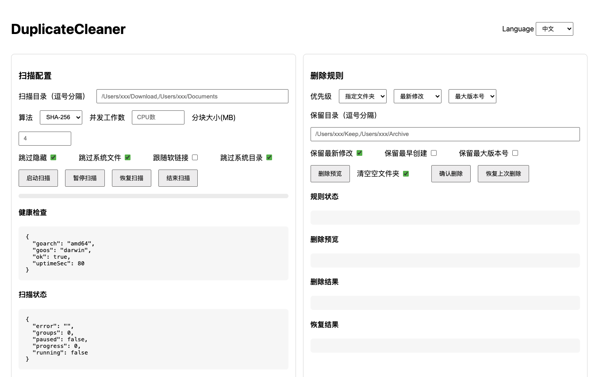

# DuplicateCleaner

语言切换： [中文](./README.zh-CN.md) | [English](./README.md)

DuplicateCleaner 是一个跨平台的多文件夹重复文件扫描与安全删除工具，内置简洁 Web UI。它以哈希值（默认 SHA-256，支持 MD5）作为重复判定的核心依据，并使用文件大小和时间戳作为辅助过滤，避免误判。删除操作默认不做永久删除，而是将文件移动到备份目录以便恢复。支持自定义规则与优先级，全流程记录操作日志，便于追溯与排查。

## 功能特性
- 精准重复判定
  - 基于哈希（SHA-256/MD5），大文件分块读取
  - 大小预过滤：大小不同必不重复
  - 变化检测：哈希计算前后如发生变化，标记异常
- 安全防护
  - 删除前强制“预览确认”
  - 删除=移动到备份目录（Duplicate_Backup），非永久删除
  - 默认跳过系统/隐藏/只读文件
- 规则与优先级
  - 保留“指定文件夹路径”下文件
  - 保留“最新修改/最早创建”（创建时间依赖系统支持）
  - 保留“最大版本号命名”（如 v2.1 > v1.9）
  - 兜底逻辑：路径字母序靠前者保留
  - 规则优先级可配置，例如 ["指定文件夹","最新修改","最大版本号"]
- 性能与兼容
  - 并发哈希（工作池）
  - 哈希缓存（按路径+尺寸+修改时间命中）
  - 软链接处理（默认不跟随，避免循环）
  - 跨系统路径自动适配（macOS/Linux/Windows）
- 日志与排查
  - 所有操作以 JSONL 记录到 `logs/duplicate_cleaner.log`
  - 包含扫描参数、结果、规则更新、预览、确认、错误信息

## 快速开始

### 环境要求
- Go 1.22+

### 启动服务
```bash
go run ./cmd/server
# 默认端口: 8713
```

### 自定义端口
```bash
go run ./cmd/server -port 9001
```

打开 Web 界面：
```
http://localhost:8713/  # 或你的自定义端口
```

## 发布版本
- 采用 GoReleaser 构建多系统发行包与校验文件（checksums）
- 产物命名：`DuplicateCleaner_vX.Y.Z_{os}_{arch}.{tar.gz|zip}`
- 覆盖系统与架构：macOS（darwin/amd64, darwin/arm64）、Linux（linux/amd64, linux/arm64）、Windows（windows/amd64, windows/arm64）
- 版本写入：通过 `-X main.Version` 注入到二进制

### 发布流程
- 创建并推送标签 `vX.Y.Z`
- GitHub Actions 自动运行 GoReleaser，生成并发布各平台构建与校验文件

## Web 界面
- 配置扫描目录、哈希算法、是否跳过隐藏/系统目录、是否跟随软链接、并发数与分块大小
- 启动扫描、查看进度、查看结果、设置删除规则优先级、预览与确认删除（移动备份）
- 状态与结果每秒自动刷新；可在界面直接暂停/恢复/结束扫描。
- 规则自动更新：修改优先级、保留目录与勾选项后立即生效（无需“更新规则”按钮）。
- 多语言支持：自动识别浏览器语言（非中文默认英文），并支持在界面手动切换中英文。
- 直接删除(放入回收站)：在“确认删除”旁的勾选项，默认不勾选。勾选后删除会进入系统回收站，不会备份（macOS: ~/.Trash；Linux: freedesktop 规范 ~/.local/share/Trash；Windows: 回收站）。

## 界面预览


## 选项工作原理
- 算法
  - 重复判定使用的哈希函数：默认 SHA-256，支持 MD5。
  - 更换算法会触发重新计算（命中缓存除外）。
- 并发工作数
  - 哈希计算的并发度；控制工作池大小。
  - 数值越高并行越多，但 I/O 压力也会增大。
- 分块大小(MB)
  - 单文件哈希的分块大小，用于高效处理大文件。
  - 分块越大，调用次数越少，但单次内存占用增大。
- 跳过隐藏
  - 跳过名称以 “.” 开头的隐藏目录与文件（如 .git、.env、.cache）。
  - 主要用于减少非内容文件的噪音。
- 跳过系统文件
  - 跳过操作系统/桌面环境生成的元数据文件：
    - macOS: .DS_Store, ._*, .localized
    - Windows: Thumbs.db, Desktop.ini
    - Linux: .directory
- 跟随软链接
  - 开启后会处理软链接指向的文件；默认关闭以避免循环与跨目录读取。
- 跳过系统目录
  - 跳过系统级目录：
    - macOS: /System
    - Linux: /usr
    - Windows: C:\Windows
- 优先级
  - 规则应用顺序；靠前的规则先收缩候选集。
  - 常见组合：[指定文件夹、最新修改、最大版本号]；并列时按路径字母序兜底。
- 保留目录
  - 优先保留位于指定目录下的文件；如命中多个，取路径字母序靠前者。
- 保留最新修改
  - 在重复项中保留最近修改的文件。
  - 创建时间在不同系统不统一；统一使用修改时间进行比较。
- 保留最早创建
  - 保留时间更早的文件；在无法获取“创建时间”时使用修改时间近似。
- 保留最大版本号
  - 从文件名中解析版本（v?X.Y.Z），保留数值上更高的版本。
  - 不包含数字或无法解析的按 0 处理；相同版本按路径字母序兜底。
- 清空空文件夹
  - 开启后在删除完成后，清理扫描目录范围内的空父级文件夹。
  - 边界为你在扫描配置中提供的目录；不会清理其范围外的目录。
  - 默认开启。

## 删除与恢复
- 删除为“移动到备份”，不会永久删除；备份目录为 Duplicate_Backup，备份文件名包含时间戳。
- 系统会在备份目录写入 Duplicate_Backup/restore_last.json，用于记录“原路径 → 备份路径”的映射。
- 恢复上次删除
  - 将备份文件恢复至原路径，若目标路径已存在则跳过以避免覆盖。
  - 用于撤销最近一次删除；如需支持更早批次，可扩展为多清单归档并在界面选择批次。
- 回收站直删模式
  - 开启“直接删除(放入回收站)”后，删除将进入系统回收站（macOS: ~/.Trash；Linux: freedesktop 规范 ~/.local/share/Trash；Windows: 回收站），不生成恢复清单，无法通过“恢复上次删除”找回。

## API 使用

启动扫描：
```bash
curl -X POST http://localhost:8713/api/scan/start \
  -H "Content-Type: application/json" \
  -d '{
    "dirs": ["/path/one", "/path/two"],
    "hashAlgo": "sha256",
    "skipHidden": true,
    "followSymlinks": false,
    "skipSystemDirs": true,
    "maxWorkers": 8,
    "chunkSizeBytes": 4194304,
    "enableHashCache": true,
    "hashCachePath": ".cache/hashes.json",
    "skipReadOnly": true
  }'
```

查看进度：
```bash
curl http://localhost:8713/api/scan/status
```

查看结果：
```bash
curl http://localhost:8713/api/scan/results
```

更新规则：
```bash
curl -X POST http://localhost:8713/api/rules \
  -H "Content-Type: application/json" \
  -d '{
    "priority": ["指定文件夹","最新修改","最大版本号"],
    "keepDirs": ["/path/keep"],
    "keepLatestModify": true,
    "keepEarliestCreate": false,
    "keepHighestVersion": true
  }'
```

删除预览：
```bash
curl -X POST http://localhost:8713/api/delete/preview
```

确认删除（移动到备份目录）：
```bash
curl -X POST http://localhost:8713/api/delete/confirm
```

确认删除并清空空文件夹：
```bash
curl -X POST http://localhost:8713/api/delete/confirm \
  -H "Content-Type: application/json" \
  -d '{ "cleanEmptyDirs": true }'
```

直接删除（回收站）：
```bash
curl -X POST http://localhost:8713/api/delete/confirm \
  -H "Content-Type: application/json" \
  -d '{ "directToTrash": true }'
```
恢复上次删除：
```bash
curl -X POST http://localhost:8713/api/delete/restore
```

## 项目结构
```
cmd/server/          # 程序入口
internal/web/        # Web 路由与界面
internal/scanner/    # 扫描与哈希
internal/hash/       # 分块哈希计算
internal/rules/      # 规则引擎与优先级
internal/backup/     # 删除=移动到备份
internal/cache/      # 哈希缓存
internal/logging/    # JSONL日志
internal/types/      # 公共类型
```

## 注意事项
- 系统目录默认跳过：
  - macOS: `/System`
  - Linux: `/usr`
  - Windows: `C:\Windows`
- 系统文件默认跳过：
  - macOS: `.DS_Store`, `._*`, `.localized`
  - Windows: `Thumbs.db`, `Desktop.ini`
  - Linux: `.directory`
- 软链接默认不跟随，可按需开启，避免循环遍历
- 创建时间在不同系统中可用性不一；“最早创建”在不可用时以修改时间近似处理

## 许可协议
MIT

English version is available at [README.md](./README.md).
